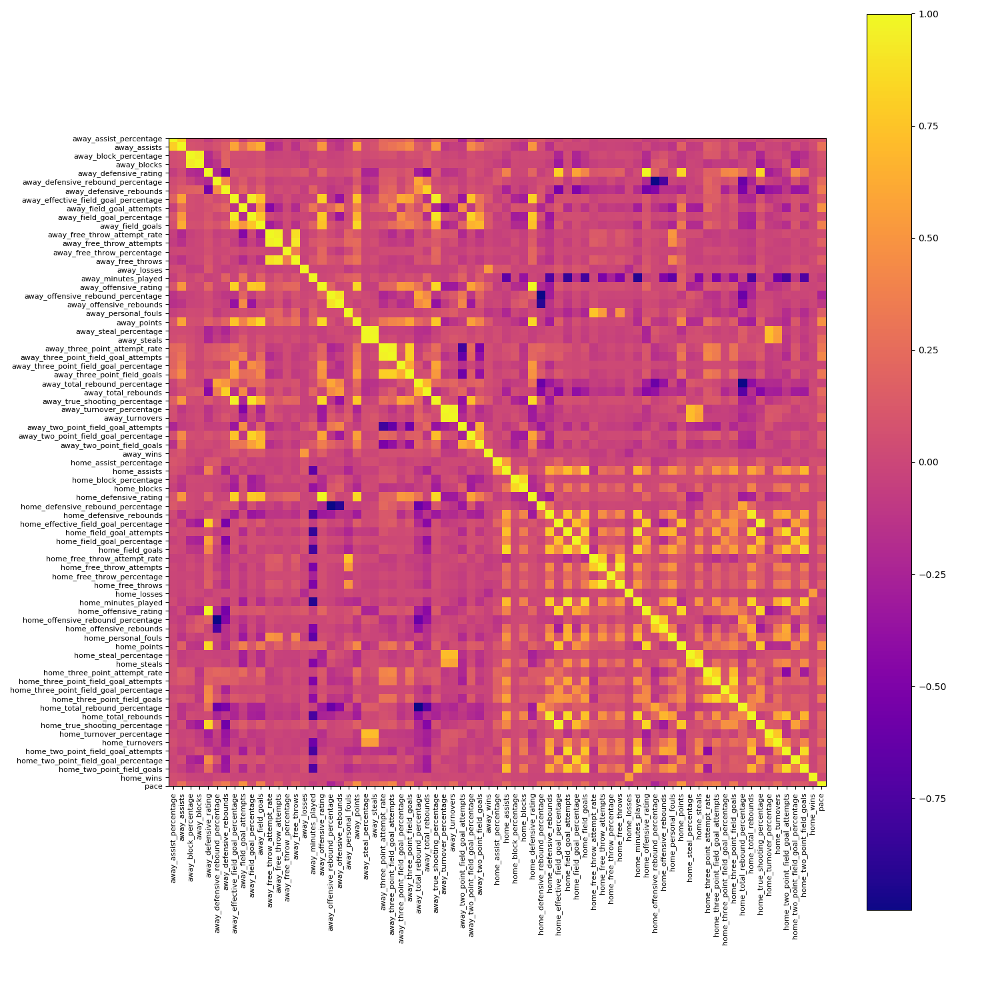
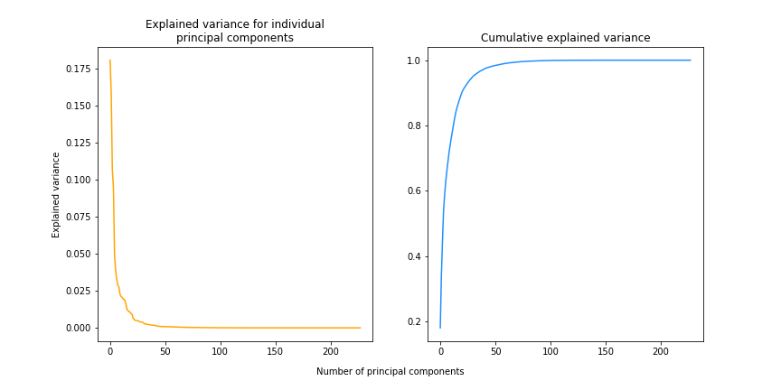
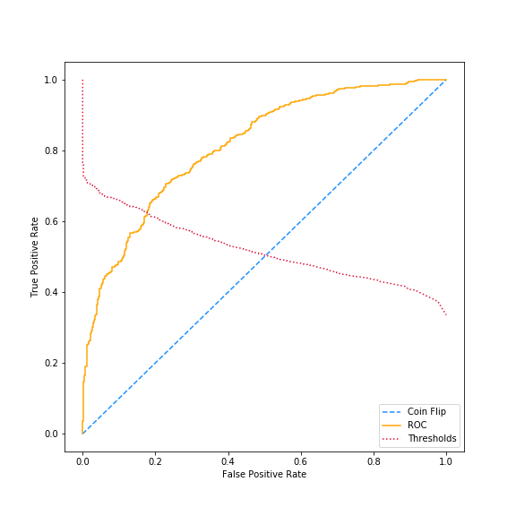
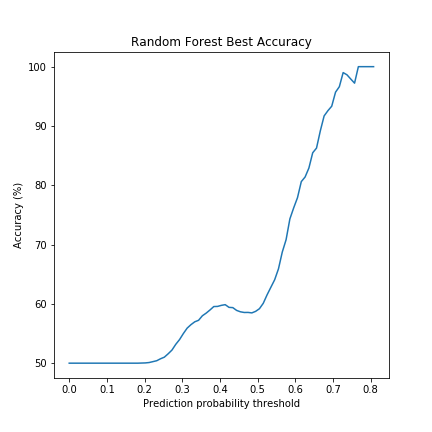
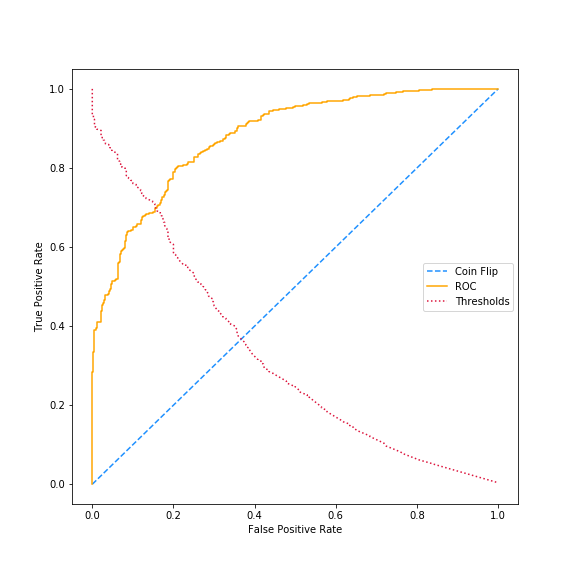
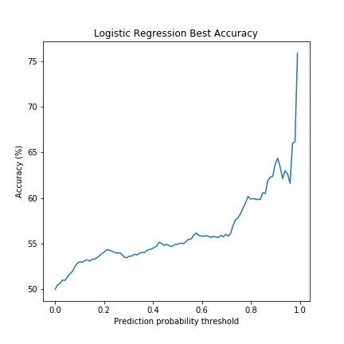

# Predicting the outcome of NBA games

I'm a big fan of the NBA, and with data easily obtainable for free, it can be
really fun to try and make the best possible predictor of NBA games. In this
project, data is collected from free, open-source APIs. Some advanced feature
engineering and data cleaning is done with the help of Pandas and then some
supervised learning methods are tested on the resulting data.

Potential future avenues for building upon this work include training a neural
network instead of vanilla machine learning classifiers and using player-level
data to capture matchup specific dependencies, an idea I tried (discussed below)
but was not able to make successful at first pass.

## Table of Contents

1. [Introduction](#introduction)
2. [Data Collection and Cleaning](#data-collection-and-cleaning)
3. [Setting up and Training Models](#setting-up-and-training-models)
4. [Results](#results)

---

## Introduction

For sports enthusiasts, the NBA is a data gold mine. There are 10 players on the
court at all times--5 from each team--and although they have different responsibilities
for the team, their performance can be measured with a standard set of statistics.
Points, rebounds, assists, blocks, and steals are just a few of the many stats
one can use to describe player performance. Team aggregate statistics can be
taken to be more revealing about a team's performance overall and capture
dependencies beyond individual player statistics, like team chemistry.

In a standard NBA season, there are 1230 regular season games (the 2019-2020 and
2020-2021 NBA seasons were shortened due to Covid-19). With that many games being
played each year, there is ample data to analyze for building a predictive model.
It is for this reason that NBA prediction was chosen over predicting the games
in my other favorite sports league: the NFL (where there are only 272 regular
season games each year). There is certainly reason to believe that with so much
data, a machine learning classifier should be able to outperform baseline
prediction by a substantial amount.

## Data collection and cleaning

Data for this project was collected from two open-source APIs. For player level
stats, data was collected from the NBA Stats API itself with the help of
[this excellent package](https://github.com/swar/nba_api) for retrieving it in
Python. Team level data came from [sports-reference](https://www.sports-reference.com/)
with the help of [this package](https://github.com/roclark/sportsipy), which is
much easier to use.

#### Player level data

Initially, data was collected for each player in each game. The exact stats
collected for each player are outlined in the appendix. It is worth noting that
several tricks were needed to make this data collection work. First, collecting
the data requires scraping it from the NBA Stats API. To prevent overloading the
API with requests, you are not allowed to make unlimited requests in short
periods of time. Too many requests too quickly and your IP address will get a
timeout. A common and easy solution is to pause between requests by adding:

    time.sleep(2)

After each API call to pause for 2 seconds.

Because of this, data collection is slow. There are over 20 API calls for each
game (for all the players that played in that game), so the data for each game
takes a while to collect. It therefore becomes important to store the data locally
so it can be retrieved much faster during training and inference. To store data
locally, I opted for creating and hdf5 file to hold the data, but something like
a SQL database or even a large CSV file could work also.

#### Team level data

The player-level data ultimately did not do well for game prediction, at least
with what I attempted. So I switched my approach to collecting team-level data.
The exact stats collected for each team are listed in the appendix.

Many of the collected features are highly correlated with each other. This makes
sense intuitively, since features like 3pt field goals made and 3pt field goal
percentage are intrinsically linked. We can see below how many of the features
are correlated, but there are still many uncorrelated features that should
give us good predictive power.

(Download the full image to see it in better detail)

#### Feature engineering

**Last 'N' games**  
An important consideration for the predictive model is that it cannot use any
information that was not available prior to each game's tip off. Having the
features for each game, then, is not useful in and of itself because the features
for a game the model might predict would not be available until after that game
has been played. Instead, we would like to get the stats for each team leading
up to the game being predicted.

For this analysis, these features are engineered as the team average of each
features over three different time horizons: the previous 5, 10, and 15 games.
Since our data is initially per game data, we need to be creative with Pandas
to average over the proper timeframes for extracting relevant features. See
[the dataset script](data/build_dataset.py) for how exactly this is done.

Averaging the stats this way greatly increases our number of features (each feature
essentially now appears 3 times, once for each different timeframe). After
formatting the data in this way, it has 228 features for each game. However, as
observed in the original data correlation matrix, many of these features are
highly correlated, and that effect is even greater now that the features cover
overlapping time periods (e.g. a team's 3pt field goal percentage over the last
5 games is highly correlated with its 3pt field goal percentage over the last 10
games). It therefore becomes important to reduce the dimensionality of the data.

**Feature scaling**  
Many machine learning models perform better after simple mean/standard deviation
feature scaling. This is a computationally efficient and common data preprocessor
that scales each feature to have a mean of 0 and a standard deviation of 1. It
is also for all intents and purposes a prerequisite of principal component
analysis (discussed below), so it is used in this analysis.

**Dimensionality Reduction**  
As noted above, many of the features collected for this
project are highly correlated. In general, multicollinearity may be less of an
issue when the goal of the classifier is to make the most accurate predictions,
rather than to estimate the true effects between independent and dependent
variables. But there are still things we can do to reduce the dimensionality of
the dataset while preserving its predictive power.

For this project, the only dimensionality reduction technique used is PCA.
PCA (principal component analysis) successively finds principal components&mdash;linear
combinations of features that are orthogonal to one another. By taking the top
`k` principal components, we can reduce the dimensionality of the dataset while
preserving as much of the variance as possible.

This plot shows the effect of increasing `k` on the explained variance in the
original dataset:

As we can clearly see, beyond the first 50 principal components, the others
contribute little to the overall variance in the training dataset. This relatively
small number (50 out of 228 initial features) is not surprising given the large
number of correlations in the original dataset. Still, the number of principal
components to retain for the best results is not immediately obvious, so it will
become a testable hyperparameter of the predictive model.

One area of future investigation would be to explore recursive feature elimination
or pick the most important features in the data by looking at the actual coefficients
in the most important principal components. These methods of dimensionality reduction
may yield better results than PCA.

## Setting up and Training Models

All the models considered in this analysis are "out of the box" machine learning
classifiers from Scikit Learn. The methodology for training them is straightforward.
For each, a grid search is run to determine the best parameters by a custom
validation function (discussed below). The models considered so far are:
- Random forest
- Logistic regression

#### Custom evaluation functions

Two custom evaluation functions are used. The first one targets the best possible
true positive rate for a fixed tolerable false positive rate. The intuition for
this evaluation is straightforward: the fixed false positive rate represents the
percentage of the time we are willing to be wrong in predicting a game. With
that tolerance threshold in place, we seek the model that captures the most games
correctly subject to that threshold.

A similar, but slightly different evaluation metric is based on getting the best
possible prediction accuracy above a fixed confidence threshold. This is similar
to the fixed tolerable false positive rate model evaluation, except in this method,
we set a minimum probability required to call a game, and then evaluate our model
based on how accurate it is for predictions above this threshold.

In practice for this project, the first evaluation method is passed as an argument
to Scikit Learn's GridSearchCV to find the best model parameters, and the second
evaluation method is used to determine our model's effectiveness under a more
realistic operating condition where we choose a fixed probability threshold for
calling a game.

#### Choosing best parameters

Best parameters for each model are chosen with Scikit Learn's GridSearchCV. Different
numbers of retained principal components ranging in multiples of 10 from 10 to 100
are also tested for each classifier. For each combo of retained principal components
and parameters, the model is evaluated using 5-fold cross validation over the entire
dataset. The best performing model is chosen according to the first custom
evaluation function described above.

#### Evaluating best model performance

Once the best parameters have been chosen, the final model is evaluated on a
holdout dataset. This is done as follows: first, the data pipeline is recreated
with the 2018-2019 season serving as a holdout dataset (this season is chosen just
because it was the last completed full NBA season). The rest of the available
data (seasons 2010-11 through 2020-21, except 2018-19) is used to train the
classifier with the parameters chosen as the best parameters. The model is
then evaluated only on the holdout data.

## Results

#### Random Forest

As expected, the random forest classifier is one of the best for this application.
Interestingly, the best model for the random forest classifier is found to be
one with 80 principal components retained, though its performance is only marginally
better than the best model with only 10 retained principal components. Since
computational expense is not a concern for the academic purposes of this project,
results are given for the model with 80 retained principal components, but in
practice, if computing resources were limited, the model with only 10 retained
principal components would likely be a better choice.

Let's take a look at the ROC curve for the best performing model:

*Note:* Since the home team winning is the event labeled as a true detection,
this ROC curve technically only shows our ability to predict the home team winning.
The custom evaluation function computes a weighted average of this with the model's
ability to predict the away team winning, though, so the results are similar.

As you can see, this model does far better than if we just flipped a coin to
predict the winner!

Now let's see how accurate the model is for different prediction thresholds:

Not bad here either!

#### Logistic Regression

Logistic regression does not perform as well for this application as random forest.
It may be the case that the two classes of data (home team win and away team win)
are not separable in the feature space. Since logistic regression essentially tries
to fit a nonlinear decision boundary, it will function best when the classes
are separable. Still we are able to do much better than the baseline.

Here's the ROC curve for our logistic regression classifier:

So it does way better than the coin flip baseline. Let's take a look at the
accuracy for different confidence thresholds:

Not as good as the random forest, but still not bad.

## Next Steps

With only two machine learning models considered in this analysis, the obvious
next step is to keep going and try different models. The two models examined here
where chosen because they are the most fitting choices for this application, but
it would be worth trying a support vector machine (SVM), Naive Bayes in conjunction
with kernel density estimation, and particularly a gradient boosting classifier,
which may perform well for this application. It may even be worth considering a
simple multi-layer perceptron (MLP), though the available data is somewhat limited for
deep learning and a MLP would quickly run the risk of overfitting as its number
of activation units grows.

Another expansion of this project would be to add a way to continue data collection
over time. The current analysis is based on a dataset that is created once from
past games. It is purely academic in this sense: more about exploring the data
for cool insights into NBA games and machine learning than for actually predicting
the outcome of a real NBA game. But a module to continue to add data could be
useful if using these models for inference (disclaimer: still intended just for
fun; I don't consider these models a good basis for sports betting and I
would discourage anyone from betting on them).
